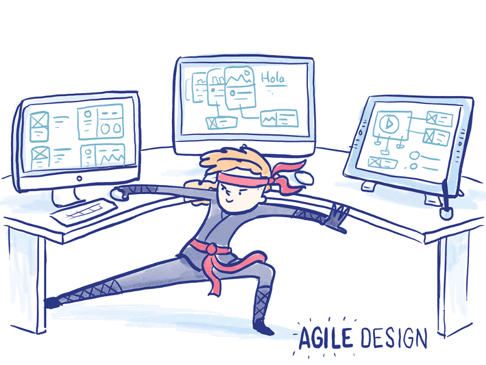

### Hi there 👋
I'm Alex and I love Python😊 
(25 y.o.)
I have finished a technical university in the Moscow Power Enginering Univercity in the field of "Power Engineering"👷.
I plan to move to IT area on the post "Python developer".

My core competencies are:
 - git, github;
 - python 3.7+;
 - django;
 - html, css.

📫 My contacts:
    Tel.: +7(995)408-90-32 
    Telegram: https://t.me/Tsoy4ik96

All major projects and templates are presented below. Watch and enjoy!
<!--
**TsoyAlV/TsoyAlV** is a ✨ _special_ ✨ repository because its `README.md` (this file) appears on your GitHub profile.

Here are some ideas to get you started:

- 🔭 I’m currently working on ...
- 🌱 I’m currently learning ...
- 👯 I’m looking to collaborate on ...
- 🤔 I’m looking for help with ...
- 💬 Ask me about ...
- 📫 How to reach me: ...
- 😄 Pronouns: ...
- ⚡ Fun fact: ...
-->
